**Step 1:** Run "MODPC.py".

- **Input:** An .xlsx file containing the coordinates of the grids to be aggregated.
- **Output:** An .xlsx file containing the window number where dense grids are located after four aggregations, along with their corresponding grid coordinates.

**Step 2:** Run "judge+.m".

- **Input:** An .xlsx file containing the results of the four aggregations.
- **Output:** An .xlsx file containing the boundaries of each aggregation window.

**Step 3:** Run "judge++.m".

- **Input:** An .xlsx file containing the boundaries of each aggregation window where no intersections exist.
- **Output:** An .xlsx file containing the boundaries of aggregation windows where no intersections exist.

**Step 4:** Run "polygon.m".

- **Input:** An .xlsx file containing the boundaries of aggregation windows where no intersections exist.
- **Output:** An .xlsx file in the format of the Amap (高德地图) interface, which can be imported into the Amap interface to visualize the final aggregation results.

**Detailed Explanation:**

In the following process, we will use GeoHash grid cells of 38m * 19m as an example to explain the novel clustering algorithm workflow in this invention.

**i. Select Grids that Meet the Criteria**

We assume that grid cells with RSRP < -105dbm are the target grid cells for our clustering analysis. In the first step of clustering analysis, we begin by filtering the data based on this condition. After the initial data filtering is complete, the grid cells that meet the selection criteria are considered as "clustering grid" data for further clustering analysis, while the grid cells that do not meet the selection criteria are categorized as "non-clustering grid."

The "non-clustering grid" cells do not participate in the final presentation of grid clustering results.

For example, let's consider the data in Beijing's Huairou District, where the Unicom weak coverage RSRP < -105dbm accounts for >= 0.3 (in red):

 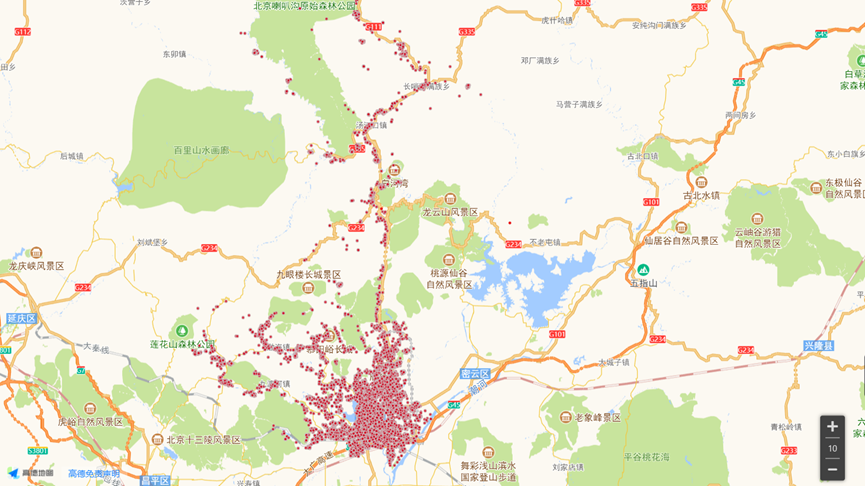

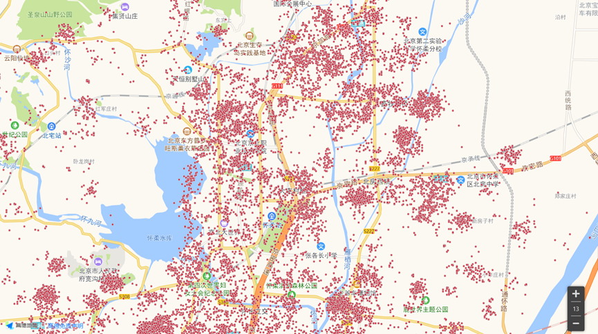

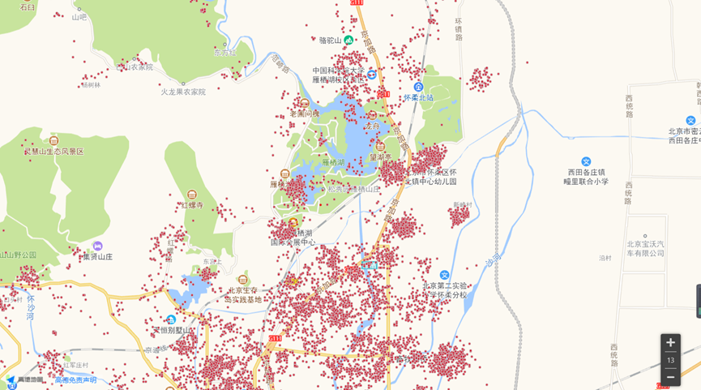

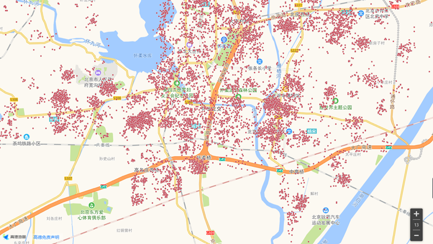

 

**ii. Filtering Initial Clusters of Discrete Grids**

During the process of filtering discrete grid cells, two filtering conditions need to be set:

**2.1 Setting the Convergence Radius (eps):**

In this filtering condition, the filtering window is set as circular (representing the base station coverage, which is circular). Since the primary objective of this process is to eliminate outliers, it is recommended to configure the filtering window within the range of 50 meters to 200 meters. The specific configuration can be adjusted based on the grid cell size.

**2.2 Setting the Threshold for Filtering Discrete Grids:**

The threshold value for this condition should be an integer greater than or equal to 1. The specific numerical value can be customized based on specific requirements. The configuration should consider the size of the grid cells and the settings of the filtering window.

For example:

- Set the Convergence Radius (in meters) to "100m."
- Set the Minimum Number of Points Within the Convergence Circle (MinPts) to "4."

According to the aforementioned filtering conditions, within a circular filtering window of 100 meters by 100 meters, if the percentage of grid cells in the window is less than 10% (calculated based on the grid cell size), it is considered that the number of grid cells in that area is relatively low. These grid cells are categorized as discrete grid cells.

**DBSCAN Convergence Area Filtering Rules:**

(1) Initially, all points are marked as "unvisited." A random point 'p' is selected as the core point, labeled as "visited," and its eps neighborhood is examined to determine if it contains at least MinPts objects. If it does not meet this criterion, the point is marked as a "discrete cluster grid." If the criterion is met, point 'p' is marked as a "dense cluster grid." A new cluster 'C' is created with 'p' as the center, and all neighboring points belonging to 'p' are included in a candidate set 'N.' This cluster is referred to as the "target grid cluster window."

(2) The DBSCAN algorithm iterates, adding points from 'N' that do not belong to other clusters to 'C,' marking them as "visited." Additionally, with point 'p' as the core point, its neighborhood is searched. If the neighborhood contains at least MinPts points, they are all added to 'N.' DBSCAN continues to search 'N' until all points in 'N' have been "visited," and the cluster 'C' is fully constructed.

(3) To find the next cluster, any "unvisited" point 'p' among all points is selected, and the above steps are continued until all points have been visited, concluding the process.

After the initial clustering is completed, the formed cluster areas are as follows:

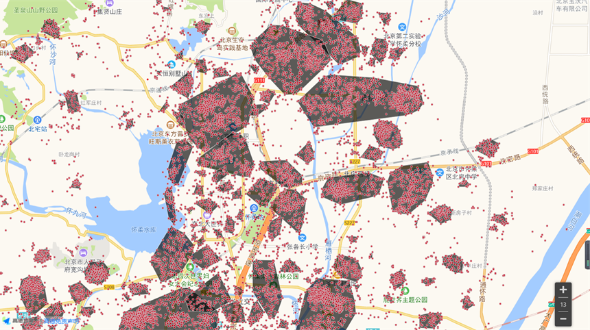

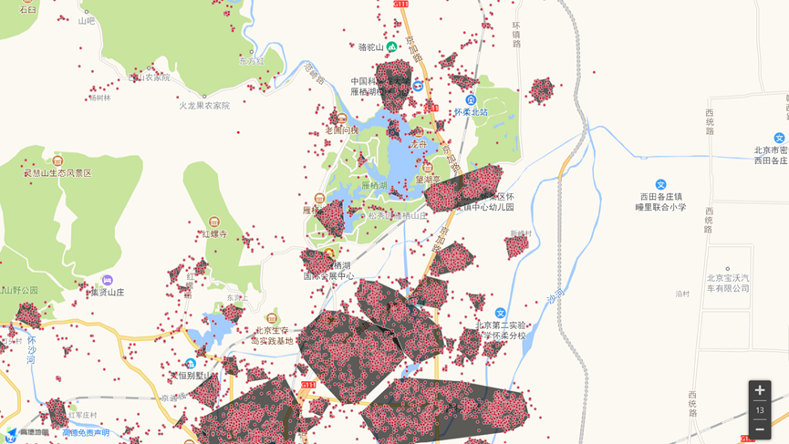

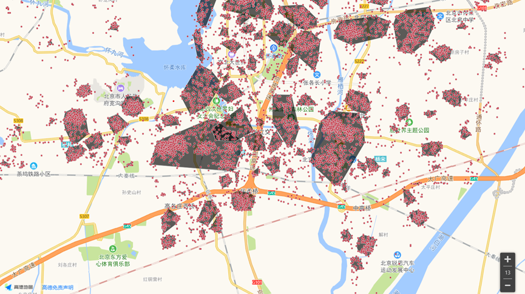

 

After completing the first data filtering, the grid data that meets the selection criteria is labeled as **"Clustering Grid"** data and marked as **"Dense Cluster Grids"** for further clustering analysis. The grid data that does not meet the selection criteria is categorized as **"Non-Clustering Grid."** Simultaneously, each convergence area that meets the selection criteria is labeled as a **"Clustering Window."**

The "Non-Clustering Grid" serves as the denominator data in the process of **"e. Setting Grid Clustering Percentage Threshold"** and does not participate in the final presentation of grid clustering results.

During the convergence area filtering process, all grid data is marked as either **"Discrete Cluster Grids"** or **"Dense Cluster Grids."** The data labeled as **"Dense Cluster Grids"** is considered the target grid data for secondary clustering analysis.

After the initial convergence, to better align with real-world scenarios and establish different clustering parameters for different types of regions based on weak coverage density, a **"Value Area Determination"** process is conducted.

In the **Value Area Determination** process, two judgment criteria need to be set: 2.3 Convergence Radius (eps') for the boundary points of clustering windows and 2.4 the threshold for the number of grid cells within the boundary points' convergence windows.

**2.3. Setting the Convergence Radius for Boundary Points (eps'):** Since there are typically fewer grid cells between region boundaries, and the boundaries are relatively close together, the eps' should not be set too large. The configuration should reference the subsequent average distance setting (e.g., 500m).

**2.4. Setting the Threshold for the Number of Grid Cells within Boundary Points' Convergence Windows:** This threshold can also consider the area formed by connecting the value areas.

The process of Value Area Determination is as follows:

(1) The basic algorithm for value area determination still uses DBSCAN, focusing on considering the boundary points of initially formed clustering windows. Initially, all clustering windows are marked as "unvisited," and a corresponding boundary point collection is formed for each clustering window. Boundary points are labeled as "no."

(2) A random window 'j' is selected as the core window, marked as "visited." The collection 'Bj' of its boundary points is extracted, and all dense grid cells in window 'j' are added to the collection 'Pathj.' For the points in collection 'Bj,' an unvisited point 'p' is selected and labeled as "yes." Using 'p' as the center and eps' as the radius, it is checked whether there is an "unvisited" boundary point within the neighborhood. If there is, all boundary points of that window are added to 'Bj,' all grid cells of that window are added to 'Pathj,' and the region is marked as "visited." If no such boundary points exist, the search continues using other unvisited points in collection 'Bj' as the center. This process continues until all points in 'Bj' have been visited (i.e., all are marked as "yes"), and 'Pathj' is fully constructed, forming a value area.

(3) For 'Pathj,' if the number of grid cells is greater than or equal to the threshold of **"2.4. the number of grid cells within boundary points' convergence windows,"** it is considered a **"Value Area."** Otherwise, it is categorized as a **"Non-Value Area."**

(4) The search for the remaining unvisited clustering windows continues, repeating the above steps to determine value areas. For clustering windows within value areas, both their grid cells and the windows themselves should be assigned **"Value Attributes"** for ease of subsequent clustering work.

In particular, the search process can begin with the largest area clustering window since value area grid cells are typically denser. Therefore, after the initial clustering, the areas around the larger windows are more likely to have many clustering windows that can be added to the corresponding value areas.

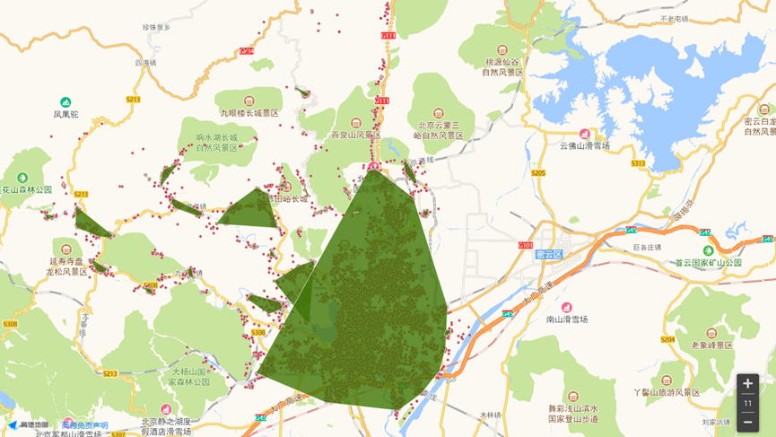

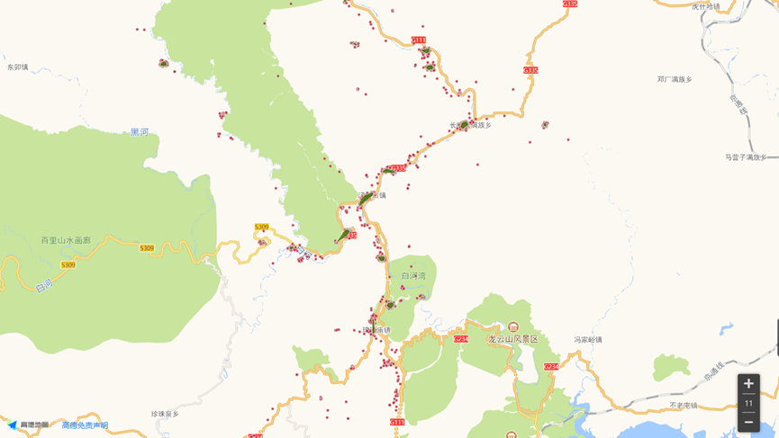

**iii. Secondary Clustering by Splitting Clustering Windows**

After the initial clustering, large continuous areas are formed that extend beyond the base station's coverage radius. Therefore, to deal with large, continuous clustering windows that don't align with real base station coverage scenarios, a secondary clustering, or splitting, is performed.

In the process of clustering area splitting, three conditions need to be set: 3.1, setting the average distance threshold for target grid clustering windows, 3.2, setting the maximum distance threshold within target grid clustering windows, and 3.3, setting the increase value 'o' for the number of points in the third convergence circle.

**For conditions 3.1 and 3.2**, the values should be set with consideration for the communication industry's base station coverage capacity. It is recommended to configure these values based on the coverage scenario and base station coverage capacity. If the average distance or maximum distance of a clustering window exceeds the threshold value, it should be split.

**For condition 3.3**, setting the increase value for the number of points in the third convergence circle, the initial value should be 1 more than the value set in 2.2 (Setting the MinPts for convergence circle). This increase makes the criteria for clustering density stricter, leading to the breaking of large, continuous clustering areas.

For example:
- Setting the average distance threshold for target grid clustering windows to 500.
- Setting the maximum distance threshold for target grid clustering windows to 500.
- Setting the increase value for the number of points in the third convergence circle to 1.

However, splitting in this manner may result in many "Dense Grids" becoming "Discrete Grids" after splitting, making them ineligible for further convergence, and, consequently, more discrete grids may surround them. Therefore, in the third clustering process, when a target split clustering window is created, noise points (discrete grids) generated during secondary clustering should be evaluated to determine whether to label them as "Discrete Grids."

In the Discrete Grid Evaluation process, three conditions need to be set: 3.4, setting the distance threshold from the Discrete Grid to the center of the target grid clustering window, 3.5, setting the density comparison for Discrete Grid entry and exit of the clustering window, 3.6, setting the average distance for Discrete Grid entry into the clustering window, and 3.7, setting the maximum distance for Discrete Grid entry into the clustering window.

**For 3.4**, the distance threshold should be set with consideration of the communication industry's base station coverage capacity. It's recommended to configure this value based on the coverage scenario and base station coverage capacity.

**For 3.5**, the density calculation is based on the number of grid cells within the clustering window. If the density decreases upon entry, the grid cell should not be entered.

**For 3.6 and 3.7**, these conditions assess whether the entry of a discrete grid into the clustering window would result in the average or maximum distance exceeding the previously set average distance threshold (500m).

Example conditions:
- Setting the distance threshold for Discrete Grids from the center of the target grid clustering window to 500m.
- Setting the density comparison for Discrete Grid entry and exit, i.e., "If the density is greater than or equal to the exit density after entry, then enter."
- Setting the average distance for Discrete Grid entry into the clustering window to 500m.
- Setting the maximum distance for Discrete Grid entry into the clustering window to 500m.

The process of clustering window splitting occurs as follows:

(1) All clustering windows after the initial clustering are marked as "unvisited." Any unvisited clustering window is selected, and its average and maximum distances are calculated. If it doesn't meet either condition 'j' or 'k,' it is subjected to secondary clustering.

(2) Clustering window 'j' is subjected to DBSCAN_Plus clustering once again, with MinPts increased by the 'o' value. For windows created in the third clustering, the newly created discrete grid cells are evaluated. If they meet the discrete evaluation conditions, they are entered into the target grid window. Otherwise, they are marked as discrete grids and added to the discrete collection 'Noise.' Subsequently, the grid cells from this re-clustering are subjected to splitting evaluation. MinPts should be increased by 'o' from the previous splitting. This process is repeated until each window no longer meets the splitting criteria, and the resulting discrete collection 'Noise' is output.

(3) Considering that during the third clustering, some large clustering windows were separated, resulting in discrete grid cells that, due to their large window radius, were not entered into any clustering windows. In the subsequent splitting of large windows, these discrete grid cells cannot participate in the evaluation, leading to the inclusion of some remaining discrete grid cells. Therefore, the discrete grid cells in the 'Noise' collection are evaluated again and attempted to be entered into the clustering windows created after the three clustering rounds. This process continues until all grid cells in 'Noise' have been evaluated.

(4) Considering that in the initial clustering, the MinPts setting was relatively small, meaning that once a certain density was reached, a grid cell could become a "Dense Grid." To maintain generality, the remaining points in 'Noise' are subjected to a further DBSCAN_Plus iterative convergence, with an initial MinPts value consistent with the value set in 2.2 (Setting the MinPts for convergence circle). This forms a new 'new_Noise' collection. Grid cells in 'new_Noise' are then evaluated for entry into 'Noise' after DBSCAN_Plus convergence, with the same discrete conditions as mentioned earlier.

 

 

**iv. Merging Target Grids in the Third Round of Clustering**

After the secondary clustering, numerous smaller "clustering windows" are created. To match the actual base station coverage scenarios, the clustering windows obtained after the initial clustering are merged into larger clusters.

In the process of **merging target grids**, three merging conditions need to be set: 4.1, setting the average distance threshold for merging grid clustering windows, 4.2, setting the maximum distance threshold within merging grid clustering windows, and 4.3, setting the center distance threshold for merging grid clustering windows.

**The calculation method for conditions 4.1 and 4.2 is as follows**: Assuming that two clustering windows, j and k, are to be merged into one window, jk, you first calculate the center point of this merged window. The center point's coordinates are the average latitude and longitude of all dense grids within the two clustering windows obtained in the initial clustering. Next, you calculate the distance, djk, of all dense grids within the merged window from the center point. Finally, you determine the maximum distance, max_djk, of dense grids from the center point within the merged grid clustering window. For conditions 4.1 and 4.2, it is recommended to set the values with a radius larger than "2.1, setting the convergence window radius size (eps)" while considering the communication industry's base station coverage capacity. It is suggested that this value should be less than or equal to 500m.

**Condition 4.3**, "setting the center distance threshold for merging grid clustering windows," can be customized based on your requirements. It serves as a measure of the inter-cluster distance. It is suggested to compare sss, a ratio which considers the distance between the center points of the dense grid clustering windows j and k and their average distances (dj and dk). Specifically, set sss = d / (dj + dk).

Importantly, djk and sss should not only be used as filtering conditions but also as indicators. A smaller djk and a larger sss indicate better clustering. A small djk suggests that the grids within the cluster are densely packed. Put differently, it's similar to the variance of grid coordinates, where a smaller variance indicates less variation, and all grid coordinates are closer to a common value, indicating denser clustering. The decision is made to merge as long as djk does not exceed the base station coverage radius. However, to avoid a gap that is too large between the two merging clusters, sss is introduced as a requirement for convergence, indicating the closeness of two clusters.

Example conditions:
- Setting the average distance threshold for merging grid clustering windows to 500m.
- Setting the maximum distance threshold for merging grid clustering windows to 500m.
- Setting the center distance threshold for merging grid clustering windows to 2 (lower values of sss result in less convergence, meaning the two clusters need to be closer).

The process of merging clustering windows is as follows:

(1) Based on the process of **iii. Clustering Window Splitting in the Second Round of Clustering**, all clustering windows are initially marked as "unvisited." An unvisited initial clustering window, j, is chosen as the root node, marked as "visited," and a search is conducted for other clustering windows. If, during the search process, there exists a clustering area, k, that satisfies the merging conditions d, f, and e, then the two clustering areas are merged. All dense grids from clustering area j are added to clustering area k, and clustering area j is cleared and removed from the search.

(2) The search continues for the next unvisited initial clustering window, which becomes the new root node, marked as "visited," and a search is conducted for other clustering windows. The above process is repeated until all initial clustering windows have been marked as visited, completing the merging clustering.

The convergence results are as follows:

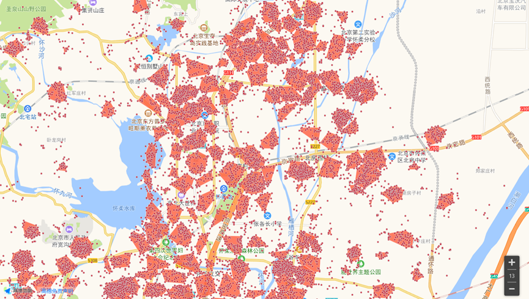

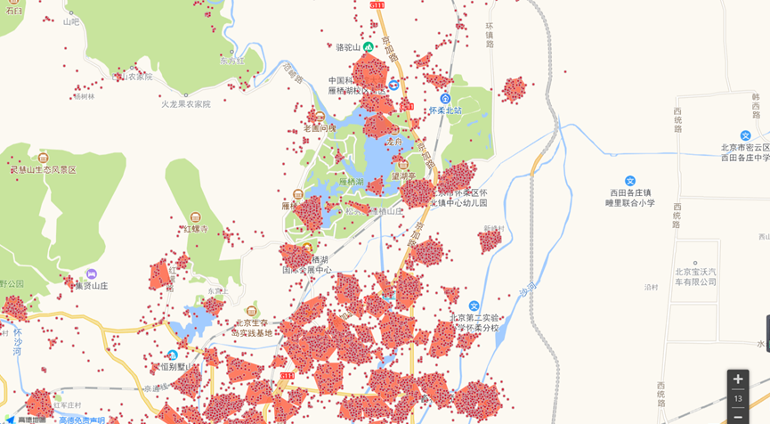

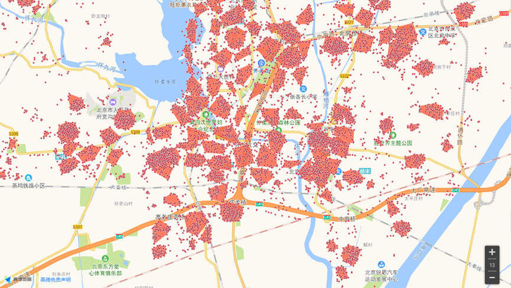

 

**v. Target Grid Contraction Clustering in the Fourth Round**

After the third round of clustering, there might be some clustering windows that contain sparse grids or some outlier points within the clustering windows. Therefore, the objective is to improve and filter the clustering windows within the target grid, which may contain dispersed dense grids or clustering windows that are relatively sparse.

In the process of contracting clustering regions, three contraction conditions need to be set: 5.1, setting the average distance threshold for ignoring target grid clustering windows (nd), 5.2, setting the dispersed distance ratio threshold within target grid clustering windows (ndd), and 5.3, setting the dispersed density threshold within target grid clustering windows.

**5.1. setting the average distance threshold for ignoring target grid clustering windows (nd)** should be less than "3.1, setting the average distance threshold for target grid clustering windows". This should consider the base station coverage capacity, and it's recommended that this value is set in line with coverage scenarios and base station coverage capacity, while also considering weaker coverage areas. Therefore, it's suggested that the value of nd should be less than the basic coverage radius of the base station.

**5.2. setting the dispersed distance ratio threshold within target grid clustering windows (ndd)** is calculated as follows: For a clustering window, j, if the farthest grid from the center point of that window is at a distance max_dj, and the average distance of all grids to the center point is dj, then the dispersed distance ratio is calculated as ndd = max_dj / dj. The closer ndd is to 1, the more concentrated the clustering, indicating that even the farthest point is within the radius of dj. In this step, for clustering window j, grids with ndd greater than the threshold value are removed, and a dispersed grid judgment is performed, determining if it can be assigned to another window or marked as a "disperse grid".

**5.3. setting the dispersed density threshold within target grid clustering windows** uses the same density calculation method as "3.5, setting the density for grids entering and exiting the clustering window". Here, for the windows to be ignored, both "5.1, average distance" and the contracted "5.3, density" must be met. In other words, these clustering windows are both small and sparse; if a clustering window is small but dense, it should not be ignored.

Example conditions:
- Setting the average distance threshold for ignoring target grid clustering windows (nd) to 150m.
- Setting the dispersed distance ratio threshold within target grid clustering windows (ndd) to 1.8.
- Setting the dispersed density threshold within target grid clustering windows to 0.3.

**The process of Target Grid Contraction Clustering** is as follows:

(1) All clustering windows obtained after the second round of clustering are initially marked as "unvisited". Any unvisited clustering window, j, is selected. Its farthest grid from the center point, known as max_dj, and the average distance of all grids to the center point, known as dj, are calculated. For the set of dense grids within window j, denoted as Cj, the dispersed distance ratio ndd is computed. If any grid farp within Cj has ndd greater than the threshold, farp is removed from Cj. Then, a search is conducted for the nearest windows (other than j) surrounding farp, which is based on the distance from farp to the center points of other windows. This search helps to reduce the workload of searching other windows.

(2) The dispersed grid judgment for the farp point is similar to the "Dispersed Grid Judgment Process" explained in "iii. Clustering Window Splitting in the Second Round of Clustering." In summary, if the window k has either an average distance dk or maximum distance max_dk greater than the threshold (500m) after farp is assigned, or if the density in window k is lower than the density outside, farp is not assigned to window k. Otherwise, farp is assigned to window k, and the search ends.

(3) The process is repeated for all grids within window j until no grid has a dispersed distance ratio greater than the threshold value, indicating that the internal contraction of window j is complete.

(4) If dj, the average distance in window j before contraction, is greater than or equal to "5.1, setting the average distance threshold for ignoring target grid clustering windows (nd)", window j is marked as "visited," and other "unvisited" windows are contracted. If dj is less than nd, the density md of window j is calculated after contraction. If md is greater than or equal to "5.3, setting the dispersed density threshold within target grid clustering windows," the contracted window is retained, and it's marked as "visited." Otherwise, for window j, after internal contraction, the remaining points are all subjected to the dispersed grid judgment, similar to the "Dispersed Grid Judgment Process" explained in "iii. Clustering Window Splitting in the Second Round of Clustering." Points that do not meet the dispersed grid judgment conditions are marked as "disperse grids." After all points within window j have been judged and transferred, window j is marked as "visited," and all points within the window are cleared.

(5) The above process is repeated until all clustering windows have been internally contracted, which means there are no unvisited windows left. The result is the output of the four-time clustering.

The results of the four-time clustering are as follows:

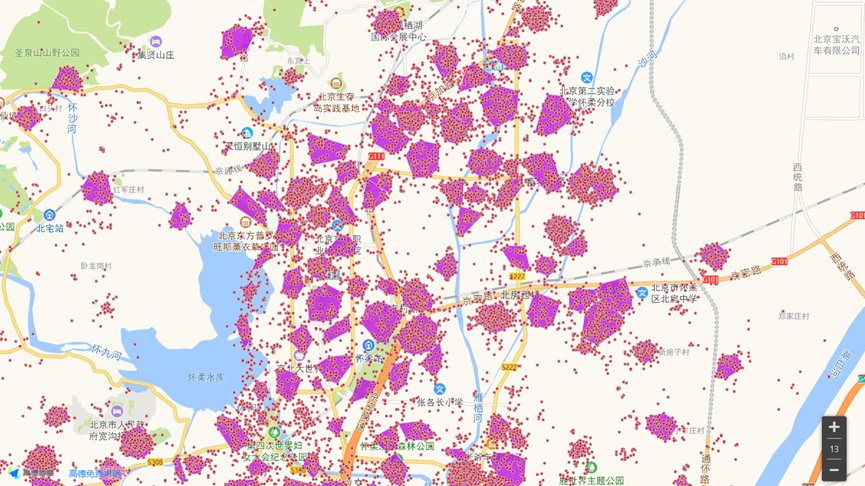

