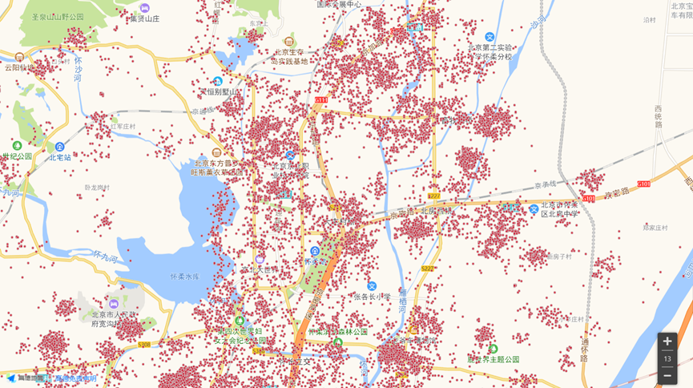
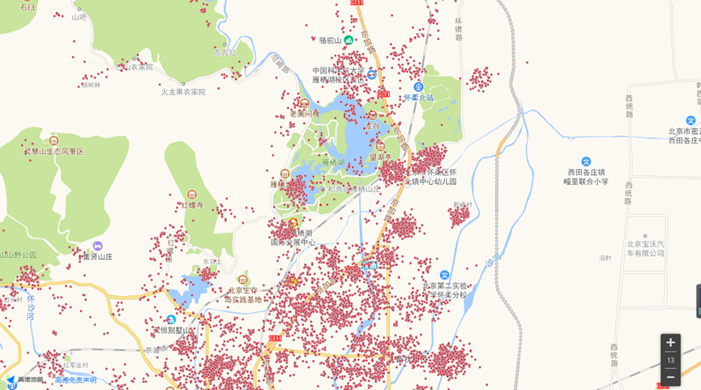
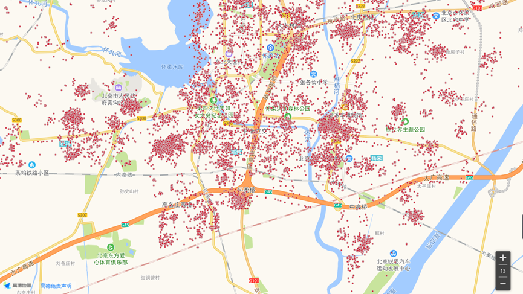
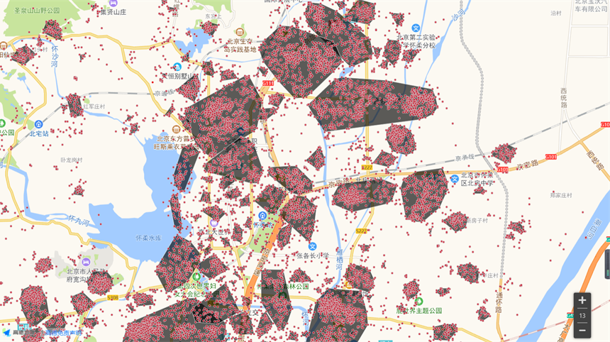
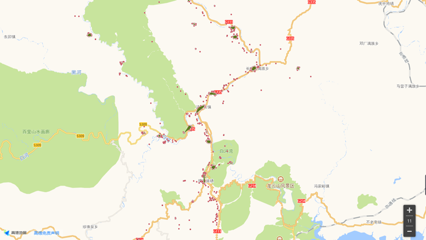
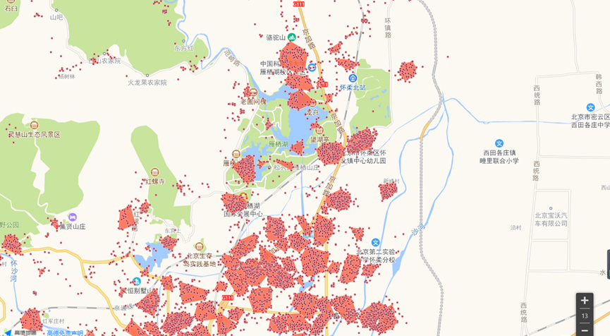
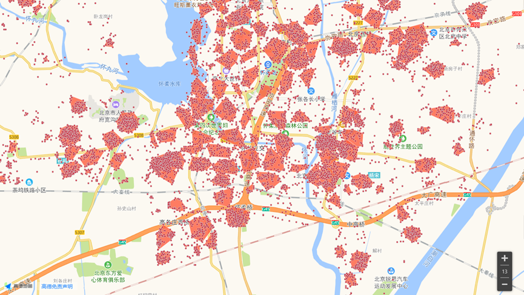
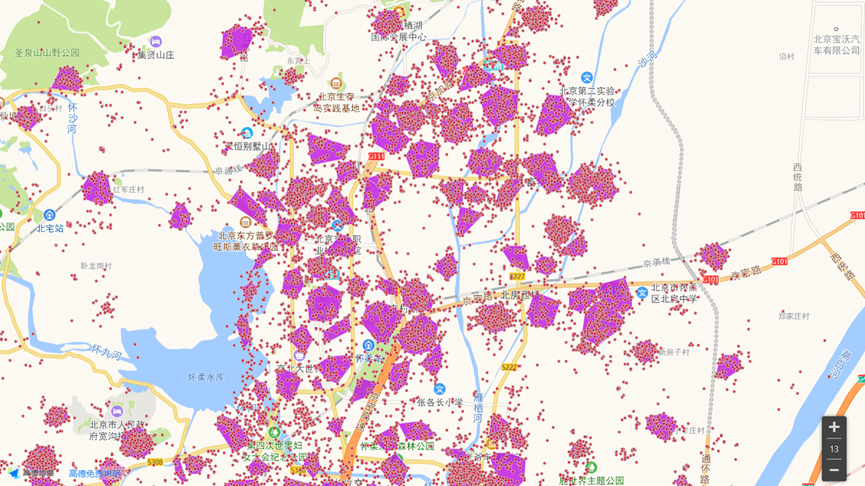

**第一步：**运行“MODPC.py”。

输入：待汇聚栅格经纬度坐标的.xlsx文件；

输出：四次汇聚后，密集栅格所在汇聚窗口的编号及栅格对应经纬度坐标的.xlsx。

**第二步：**运行judge_.m”。

输入：四次汇聚后的汇聚结果的.xlsx文件；

输出：每个汇聚窗口边界的.xlsx文件。

**第三步：**运行“judge_last.m”。

输入：每个汇聚窗口边界的.xlsx文件；

输出：不存在交汇的汇聚窗口边界的.xlsx文件。

**第四步：**运行“polygon.m”。

输入：不存在交汇的汇聚窗口边界的.xlsx文件。

输出：高德地图接口格式的汇聚窗口边界的.xlsx文件，可以导入高德地图接口，可视化最后汇聚结果。

注：“judge_last.m”为“judge_”的子函数，需要放在同一个运行文件夹下。

**详细说明如下：**

下文流程中均以GeoHash码栅格38m*19m为例进行说明，对本发明中的全新聚类算法流程进行介绍。

**i****、筛选满足条件栅格**

我们假定RSRP＜-105dbm的栅格为我们需要进行聚类分析的目标栅格，那么，在聚类分析第一步，我们先根据条件进行第一步数据筛选。在完成第一次数据筛选后，将满足筛选条件的栅格数据作为“聚类栅格”数据，进行后续的聚类分析；将不满足筛选条件的栅格数据作为“非聚类栅格”。

“非聚类栅格”不参与最终的栅格聚类结果呈现。

以北京市怀柔区联通弱覆盖RSRP＜-105dbm占>=0.3（红色）的数据为例：

 

 

**ii****、过滤离散栅格初次聚类**

在过滤离散栅格的过程中，需要完成2个过滤条件的设置，分别是：2.1、设置汇聚半径大小eps、2.2、设置汇聚圈内点个数MinPts。

过滤条件“2.1、设置汇聚半径大小eps”中的过滤窗口设置为圆形（基站覆盖为圆形）。由于该流程重点工作为删除离散点，因此过滤窗口的推荐配置为50m-200m，具体配置可以栅格大小作为依据设置。

过滤条件“2.2、设置离散栅格过滤数量门限”中的门限值为≥1的整数，数值大小可以根据需求进行自定义，具体配置可以依据栅格大小和过滤窗口配置。

例：2.1、设置汇聚半径大小eps（米）为“100m”；

2.2、设置汇聚圈内点个数MinPts为“4”。

依据上述的过滤条件设置，在100m*100mΠ的圆形过滤窗口内，在过滤窗口范围内，如果过滤窗口内的栅格占比小于10%，（由于栅格为19×38m：4*19*38/（100*100*3.14）=10%）那么我们认为该区域内栅格数量较少，判定该区域内栅格样本为离散样本，将这些栅格定义为离散栅格。

DBSCAN汇聚区域筛选规则：

 （1）、初始所有点被标记为“unvisited”。随机选取一点p作为核心点，标记为“visited”，并检查以p为圆心的eps邻域，是否至少包含MinPts个对象。如果不包含，该点标记为“离散聚类栅格”。如果包含，则将p标记为“密集聚类栅格”，并以p为圆心，创建一个新簇C，把属于p的邻域点全部放在候选对象N中，其中簇C称为“目标栅格聚类窗口”。

（2）、DBSCAN迭代，对N中不属于其他簇的点p’，添加到C中，同时标记为“visited”。同时，以p’作为核心点，搜索其邻域。如果它的邻域，至少有MinPts个点，则全部添加到N中。DBSCAB继续搜索N，直至N为中所有点为“visited”，无法继续搜索时，簇C构建完成。

（3）、为了找到下一个簇，寻找所有点中任意一个“unvisited”p点，继续以上步骤，直至所有点都被访问过，结束。

 

完成初次聚类后，形成聚类区域如下：

 

在完成第一次数据筛选后，将满足筛选条件的栅格数据作为**“聚类栅格”**数据，标注为**“密集聚类栅格”**，进行后续的聚类分析；将不满足筛选条件的栅格数据作为**“非聚类栅格”**。同时，将满足筛选条件的每个汇聚区域标注为**“聚类窗口”**。

“非聚类栅格”在“e、设置栅格聚类占比门限”流程中，作为栅格总数量分母数据，不参与最终的栅格聚类结果呈现。

在汇聚区域筛选过程中，依次对全部栅格数据进行标记，分别标记为**“离散聚类栅格”、“密集聚类栅格”**2种类型。将“密集聚类栅格”数据作为目标栅格数据进行二次聚类分析。

在初次汇聚后，为更好地符合现实场景，也为后续针对不同区域类型，根据弱覆盖密度，设立不同聚类参数，对初次汇聚形成的“密集聚类栅格”进行价值区域判断。

在**价值区域判断**过程中，需要完成2个判断条件的设置，分别是：2.3.聚类窗口边界点的汇聚半径大小eps’，2.4.边界点汇聚窗口的栅格数量门限。

“2.3、聚类窗口边界点的汇聚半径大小eps’”，由于每个区域边界与边界点之间，较为空旷，即没有过多的栅格，且边界与边界之间较为紧密，所以eps’的设置不应过大，应该参考后续的平均距离设置（500m）。

“2.4、边界点汇聚窗口的栅格数量门限”，也可以考虑连结形成的价值区域面积。

价值区域判断过程如下：

（1）、价值区域判断的基础算法仍采用DBSCAN，城村判断出于对初次汇聚形成的聚类窗口边界点进行考虑。初始时将所有初次聚类窗口标记为“unvisited”，并对每一个聚类窗口都形成一个相应的边界点集合，边界点标记为“no”。

（2）、随机选取一个窗口j作为核心窗口，标记为”visited”，提取其边界点对应的集合Bj,同时在集合Pathj中添加窗口j中的所有密集栅格。对集合Bj中的点，选取一个未访问的点p，标注为“yes”，以其为圆心，eps’为半径，在其邻域中，是否存在一个“unvisited”的区域中的边界点。如果存在，将该窗口的边界点全部加入Bj，该窗口的所有栅格加入Pathj，且将该区域标记为“visited”。如果不存在，再以集合Bj中其他未访问的点，以其为圆心搜索邻域。直至Bj中所有点都被访问过，即都为“yes”时，Pathj构建完成，其为一个城村区域。

（3）、对于pathj，如果它的栅格数量大于等于“2.4.边界点汇聚窗口的栅格数量门限”，其为**“价值区域”**，否则为**“非价值区域”**。

（4）、搜索其余未访问的聚类窗口，循环以上步骤，判断城村区域。对于是价值的区域中的聚类窗口，其栅格以及窗口都应赋予**价值属性**，方便后续的聚类工作。

特别地，上述搜索过程，可以从面积最大的聚类窗口开始搜索，因为价值区域栅格是较为密集的，因此初次聚类后，面积较大的窗口周边大概率是存在很多聚类窗口可以加入相应价值区域的。

接下来，可以根据区域的价值属性，分别进行聚类。例如，可以先将是价值属性的密集栅格提取汇聚，剩余栅格归为非价值属性(800m)处理。

以下部分以价值（300-500m）属性栅格为例。

 

**iii****、聚类窗口拆分二次聚类**

 在初次聚类后，会生成大面积连片区域，超出基站覆盖半径。因此，对不符合实际基站覆盖场景的大面积连片聚类窗口进行拆分，即二次聚类。

在聚类区域拆分的过程中，需要完成3个拆分条件的设置，分别是： 3.1、设置目标栅格聚类窗口的平均距离门限，3.2、设置目标栅格聚类窗口中的最大距离门限，3.3、设置三次汇聚圈内点个数增加值o。

拆分条件“3.1和3.2”应考虑到通信行业基站覆盖能力问题，建议该值配置结合覆盖场景和基站覆盖能力。如果该聚类窗口的平均距离或最大距离超出门限值，则对其进行拆分。

拆分条件“3.3、设置三次汇聚圈内点个数增加值o”，初始值应为“2.2、设置汇聚圈内点个数Minpots”，建议每次增加1个，即增大对汇聚区域汇聚密度的标准，使大片连结的汇聚区域断开。

例：g、设置目标栅格聚类窗口的平均距离门限为500；

h、设置目标栅格聚类窗口中的最大距离门限为500；

i、设置三次汇聚圈内点个数增加值为“1”。

但是，由于这样拆分，导致很多原本的“密集栅格”在拆分后变成“离散栅格”，不能进行汇聚，使得周围的离散栅格较多。因此，对于在三次聚类过程中，针对某个目标拆分聚类窗口，在二次聚类时，产生的噪声点（离散栅格），进行离散判断，确定是否将其标注为“离散栅格”。

 

在离散栅格判断的过程中，需要完成3个离散条件的设置，分别是：3.4、设置离散栅格距离目标栅格聚类窗口中心点的距离门限，3.5、设置离散栅格划入划出聚类窗口的密度比较，3.6.设置离散栅格划入聚类窗口的平均距离，3.7、设置离散栅格划入聚类窗口的最大距离。

离散栅格判断条件中，“3.4、设置离散栅格距离目标栅格聚类窗口中心点的距离门限”为基础判断条件，应考虑到通信行业基站覆盖能力问题，建议该值配置结合覆盖场景和基站覆盖能力。

“3.5、设置离散栅格划入划出聚类窗口的密度”，密度计算：首先，设密度得分为f，对于聚类栅格中，所有距离中心点的距离小于等于平均距离的栅格个数。（说明在基站辐射区域内，能够辐射到的点个数越多，说明该区域汇聚的点不仅紧凑且密集）。则，密度为Md=(f*38*19)/(目标栅格聚类窗口j的平均距离dj*dj*Π)。然后，分别计算该离散栅格划入和划出后，聚类窗口密度大小（划入划出肯定dj,f都可能会变）。若划入后密度减小，则不划入，

“3.6、设置离散栅格划入聚类窗口的平均距离，3.7、设置离散栅格划入聚类窗口的最大距离”，即将该离散栅格划入聚类窗口后，窗口的平均距离和最大距离是否会超出之前设定的平均距离门限（500m）。如果超出3.6、3.7任意一值超出，则不划入该栅格。

注意：在假设将该离散栅格划入聚类窗口时，该聚类窗口的中心点坐标、最大距离、平均距离都需要重新计算。

例：3.4、设置离散栅格距离目标栅格聚类窗口中心点的距离门限为“500m”；

3.5、设置离散栅格划入划出聚类窗口的密度比较，“若划入后，大于等于划出密度，则划入”；

3.6.设置离散栅格划入聚类窗口的平均距离为“500m”；

3.7、设置离散栅格划入聚类窗口的最大距离为“500m“。

 

聚类窗口拆分二次聚类过程如下：

（1）、将所有初次聚类后的聚类窗口，标记为“unvisited”，选取任意一个未访问的聚类窗口，计算其平均距离和最大距离，对不符合j、k任意一个条件的窗口j，对其进行二次聚类。

（2）、对窗口j再次进行DBSCAN_Plus聚类，此次聚类的MinPts是在原有基础上加上增加值o。对于三次聚类产生的窗口，首先，将此次汇聚产生的离散栅格进行离散判断，如果符合离散判断条件，划入目标栅格窗口，否则标注为离散栅格，并添加至离散集合Noise。接着，对再次汇聚的栅格进行拆分判断，如果符合拆分条件，则继续拆分，其中MinPts应在刚才拆分基础上，再次增加o。循环以上步骤，直至每一个窗口，都不再符合拆分条件，且输出离散集合Noise。

（3）、考虑到在三次聚类过程中，由于前几次聚类时存在一些较大的聚类窗口，分离出的一些离散栅格，由于本身窗口半径较大，因此即使进行离散判断，也未能将其划入聚类窗口，但是在后续对大窗口再拆分时，这些离散栅格不能再参与判断，从而导致出现一些仍能划入的离散栅格。因此，对于离散集合Noise中的离散栅格，再次尝试划入刚才三次聚类后的聚类窗口，即对于Noise中的所有栅格，遍历所有聚类窗口，对符合离散判断条件的栅格，划入对应聚类窗口，且从Noise中删除。直至Noise中所有栅格访问完毕。

（4）、考虑到在初次聚类时，MinPts设定值较小，即达到一定密度，就可以成为“密集栅格”。为不失一般性，对Noise中的剩余点，再次进行DBSCAN_Plus迭代汇聚，此次汇聚中，MinPts初始值应与“2.2、设置汇聚圈内点个数MinPts”一致，且形成新的new_Nosie集合，并对new_Noise集合中的离散点再次尝试划入刚才Noise进行DBSCAN_Plus汇聚后形成的窗口，仍然是上述的离散条件判断。

 

 

**iv****、目标栅格合并三次聚类**

在二次汇聚后，形成了较多较小的“聚类窗口”。为符合实际基站覆盖情况，对初次汇聚后，筛选出的“聚类窗口”进行合并聚类。

在**目标栅格合并聚类**的过程中，需要完成3个合并条件的设置，分别是： 4.1、设置合并栅格聚类窗口的平均距离门限，4.2、设置合并栅格聚类窗口中的最大距离门限，4.3、设置合并栅格聚类窗口的中心距离门限。

合并条件“4.1和4.2”的计算方法为：假设将要合并的两个聚类窗口j和k可以合并为一个窗口jk，首先，计算该合并窗口的**中心点**，**中心点坐标为两个初次汇聚后的聚类窗口中所有密集栅格的经纬度平均值。**其次，计算合并窗口中所有密集栅格距离中心点的距离djk。最后，对于合并栅格聚类窗口jk中，计算密集栅格中距离中心点的最大距离max_djk。对于“4.1、设置合并栅格聚类窗口的平均距离门限，4.2、设置合并栅格聚类窗口中的最大距离门限”的设定值，由于过滤窗口设置为圆形，半径可以根据需求进行自定义，建议配置该值＞“2.1、设置汇聚窗口半径大小eps”，同时，考虑到通信行业基站覆盖能力问题，建议该值配置≤500m。

合并条件“4.3、设置合并栅格聚类窗口的中心距离门限”可以根据需求进行自定义，其作为**簇间距离**的一个衡量标准”建议与将要合并的两个聚类窗口j、k的平均距离相比较，即采用比值形式：设置sss=密集栅格聚类窗口j与k中心点间的距离d /（密集栅格聚类窗口j的平均距离dj+密集栅格聚类窗口k的平均距离dk）。

特别地，djk与sss除了是过滤条件，更应该作为一种判断标准。Djk是对聚类窗口内的栅格汇聚好坏进行评判，sss是对聚类窗口与其他聚类窗口间的汇聚好坏进行评判。Djk越小，sss越大说明聚类越好。如果djk（dj,dk）越小，说明该簇中的栅格汇聚较为紧凑。换句话说，可以理解为该窗口中所有栅格的方差值，方差越小，代表波动越小，即所有栅格的坐标都较为平稳，集中于同一个值，说明汇聚较为紧凑。此处，本应该是如果合并后的窗口djk小于等于初次汇聚的两个窗口的平均距离，或者小于等于两个窗口中最小的平均距离，即djk<= (dj/dk)/2或者djk<=min(dj,dk)，说明合并后的窗口比原先的初次窗口更紧凑。但由于这样不符合实际建站标准，略微有些浪费，所以才认为只要不超过基站覆盖半径，就可以合并，当然为了防止两块汇聚窗口间间隙过大，所以再增添sss作为一个汇聚要求，作为簇间距离的衡量标准，其越小说明两簇越应该汇聚。

例：4.1、设置合并栅格聚类窗口的平均距离门限为“500m”

4.2、设置合并栅格聚类窗口中的最大距离门限为“500m”

4.3、设置合并栅格聚类窗口的中心距离门限为“2”。(sss设置越小，越不易合并，则两块需要距离的更近。)

**合并聚类过程**如下：

（1）、依据 “iii、**聚类窗口拆分二次聚类**”过程中汇聚好的栅格窗口，将其全部标为”unvisited”。任选一个未访问过的初次聚类窗口j，以其作为根节点，将j标记为“visited”,搜索其余全部聚类窗口。若搜索过程中，存在一个聚类区域k同时满足d、f、e的合并条件，则将两个聚类区域进行合并，且将聚类区域j的密集栅格添加至聚类区域k，并将聚类区域j清除，停止搜索。

（2）、继续寻找下一个未访问的初级聚类窗口，将其作为新的根节点，标记为”visited”，搜索其余全部聚类窗口，反复进行以上过程，直到所有的初次聚类窗口都被标记为已访问，完成合并聚类。

汇聚结果如下：

 

**v.** **目标栅格内缩四次聚类**

在三次聚类后，存在一些较为栅格稀疏的聚类窗口，或聚类窗口中存在一些偏离点。因此，针对目标栅格聚类窗口中可能存在的偏离密集栅格，以及较为稀疏的聚类窗口进行改进和筛选。

在聚类区域内缩的过程中，需要完成3个内缩条件的设置，分别是： 5.1、设置忽略目标栅格聚类窗口的平均距离门限nd，5.2、设置目标栅格聚类窗口中的离散距离比ndd门限、5.3、设置目标栅格聚类窗口中的离散密度门限。

“5.1、设置忽略目标栅格聚类窗口的平均距离门限nd”，应该小于“3.1、设置目标栅格聚类窗口的平均距离门限”，应考虑到通信行业基站覆盖能力问题，建议该值配置结合覆盖场景和基站覆盖能力，同时也考虑较多覆盖一些弱覆盖区域。因此，建议nd的值小于基站的基础覆盖半径。

“5.2、设置目标栅格聚类窗口中的离散距离比ndd门限“，计算方法：对于聚类窗口j，设其距离中心点最远的栅格距离为max_dj, 各个栅格距离中心点的平均距离为dj，则离散距离比：ndd=max_dj/dj。离散距离比ndd越趋近于1，说明汇聚的越集中，即最远的点也在辐射半径dj内。在这里，对于聚类窗口j中，ndd大于门限值的最远密集栅格，将其从窗口j中剔除，且进行**离散栅格判断**，即判断其是否可以划入其他窗口，或变为“离散栅格”。

“5.3、设置目标栅格聚类窗口中的离散密度门限”，计算方法与“3.5、设置离散栅格划入划出聚类窗口的密度”中的密度计算方法一致。在此，对于将要忽略的窗口，要求是在“5.1、平均距离”和内缩后“5.3、密度”同时都不满足的情形下，才予以忽略，即这类聚类窗口汇聚的又小又稀疏，如果聚类窗口小，但是密集，则不应忽略。

例：5.1、设置忽略目标栅格聚类窗口的平均距离门限nd为“150m”；

5.2、设置目标栅格聚类窗口中的离散距离比ndd门限为“1.8”；

5.3、设置目标栅格聚类窗口中的离散密度门限为“0.3”。

 

**目标栅格内缩四次聚类**过程如下：

（1）、将所有二次聚类后的聚类窗口，标记为“unvisited”，选取任意一个未访问的聚类窗口j，计算其窗口内距离中心点最远的栅格的距离，即最大距离max_dj，以及窗口内各个栅格距离中心点的平均距离dj。对于窗口j中的密集栅格集合Cj，计算其离散距离比ndd，若存在ndd大于门限值的点farp，则将farp栅格从Cj中清除，同时，搜索farp周围的除j的就近窗口，可以以farp距离其他窗口中心点的距离衡量就近程度，进行初筛，减少一些对其余窗口的搜索的工作量。

（2）、对于farp点的离散栅格判断，与“iii、聚类窗口拆分二次聚类”中的“离散栅格判断过程”相同，即假设将farp划入聚类窗口k，如果窗口k的平均距离dk或最大距离max_dk大于门限（500m），或者，划入密度小于划出密度，则不划入。否则，划入窗口k，搜索结束。

（3）、循环窗口j中所有栅格，直至没有栅格距离中心点的距离与平均距离的比值，即离散距离比大于门限值时，窗口j内缩完毕。

（4）、如果窗口j在内缩前的dj大于等于“5.1、设置忽略目标栅格聚类窗口的平均距离门限nd”，则将窗口j标记为“visited”，并继续内缩其他“unvisited”窗口。如果dj小于nd，计算内缩后，窗口j的密度md。如果md大于等于“5.3、设置目标栅格聚类窗口中的离散密度门限”，则保留内缩后的该窗口，且将其标注为“visited”。否则，对于该聚类窗口j中，内缩后的剩余点全部进行离散栅格判断，与“iii、聚类窗口拆分二次聚类”中的“离散栅格判断过程”相同，将其尝试划入其他窗口，不满足离散栅格判断条件的点，就将其标注为“离散栅格”，对窗口j中所有点判断完毕和转移后，将窗口j变为“visited”，且清空该窗口所有点。

（5）、循环以上步骤，直至所有聚类窗口内缩完毕，即没有未访问的窗口，输出内缩后的四次聚类窗口结果。

四次聚类结果如下：

